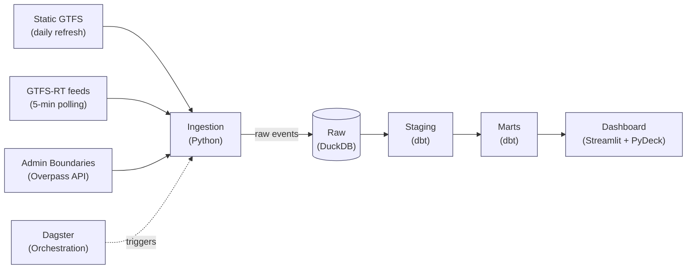
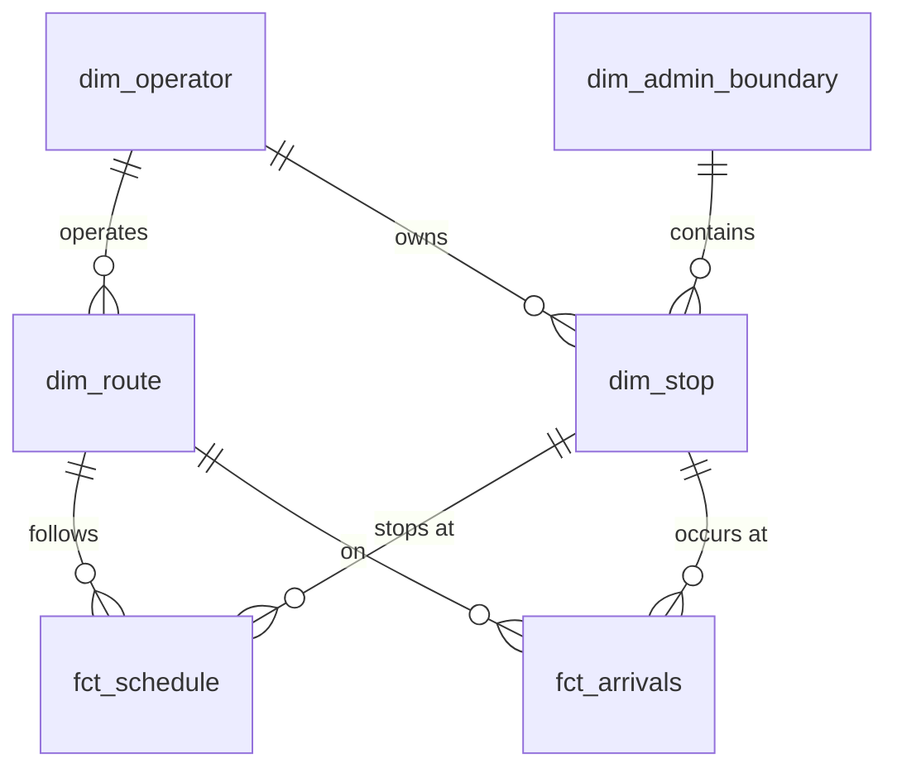

# Transit Mesh, German Nationwide Transit Intelligence Platform

Spatial-temporal data platform tracking German public transport from country level down to village/stop level, built on GTFS-RT and static GTFS feeds.

**Stack:** Python · SQL · DuckDB · MotherDuck · dbt · Dagster · Streamlit (PyDeck + Plotly) · GitHub Actions

## Run locally

Requires [uv](https://docs.astral.sh/uv/) and `make`.

```bash
make setup      # uv sync + create .env
make pipeline   # ingest everything + dbt build, end to end
make app        # launch the Streamlit dashboard
```

`make dagster` launches the orchestrator UI for scheduled/on-demand runs. Run `make help` for the full list of targets.

## Deployed

- **Dashboard:** [transitmesh-de.streamlit.app](https://transitmesh-de.streamlit.app/)
- **Pipeline runs (GitHub Actions):** [github.com/gunjanmishra94/transit-mesh/actions](https://github.com/gunjanmishra94/transit-mesh/actions), realtime ingestion every 5 min, static GTFS refresh daily, both building on a shared [MotherDuck](https://motherduck.com) database. Triggered by a small Cloudflare Worker (`cron-trigger/`) via `repository_dispatch`, since GitHub's native `schedule:` trigger is unreliable at this frequency — see `cron-trigger/README.md`.

---

## Problem statement

This project ingests Germany's fragmented public transport ecosystem — hundreds of regional operators, incompatible ticketing systems, incomplete coverage — and turns it into a single, queryable, spatially-aware dataset.

German transit data is notoriously messy: the DB operates intercity trains, local transit is split across VBB (Berlin), MVG (Munich), KVB (Cologne), and dozens of regional agencies. Static GTFS feeds are incomplete or out of sync, realtime GTFS-RT updates arrive late or contradict each other, and administrative boundaries (district, region, state) don't align with service areas. Questions like:

- Which routes are underperforming across all of Germany?
- How many stops lack realtime vehicle location data?
- Which transit agencies have the best on-time performance?
- Are there coverage gaps between state boundaries?

...are impossible to answer without a unified dataset that spans operators and reconciles boundaries.

## Impact/value

- **One source of truth.** Every feed is deduplicated and reconciled against its operator, so the same route ID in Berlin and Bavaria doesn't get conflated.
- **Spatial queries at scale.** Every stop is enriched with administrative geometry — district, region, state — so "transit coverage in rural areas" becomes a single SQL query, not a manual spreadsheet.
- **Live data that stays live.** The realtime ingestion pulls GTFS-RT every 5 minutes and merges it with scheduled data, so actual arrival times replace scheduled ones as they arrive.
- **History that survives operator changes.** Static GTFS changes accumulate in Type 2 slowly-changing dimension tables, so route modifications don't erase the past.

## Architecture



- **Ingestion:** pulls static GTFS and GTFS-RT from each transit agency, enriches stops with admin boundaries via reverse-geocoding, handles schema variations across feeds (some agencies omit optional fields).
- **Raw:** the ingested feeds land untouched, one table per feed type. GTFS-RT snapshots are appended, not upserted, so we keep history for delay analysis.
- **Staging:** one model per source table: normalizes routes/trips/stops across agencies, converts all stop/vehicle times to UTC, flags schema mismatches and duplicates. No joins.
- **Marts:** the actual product. Fact tables for vehicle arrivals and route-stop pairs, surrounded by dimensions for stops, routes, and operators.
- **Dashboard:** realtime vehicle positions on a map, agency comparison dashboards, delay analytics by operator and time of day.

## Data model

A **fact-dimension schema**: vehicle arrivals and stop schedules (facts) annotated with stops, routes, and operators (dimensions).

| Table | What it holds | Question it answers |
|---|---|---|
| `fct_arrivals` | Observed vehicle arrivals at stops (realtime GTFS-RT) | Which buses arrived late, and by how much |
| `fct_schedule` | Scheduled arrivals for every stop on every route | What *should* have arrived when |
| `dim_stop` | One row per stop per version of its details | What's at this location, which district, which operator |
| `dim_route` | One row per route per version of its service pattern | What agency runs this, what fare zone, what stops does it serve |
| `dim_operator` | One row per transit agency | Name, service area, coverage, contact |
| `dim_admin_boundary` | One row per district/region/state and stop combinations | Which administrative level(s) serve this stop |



`fct_arrivals` captures observed vehicle positions; the grain is **one row per vehicle per stop per timestamp**. `fct_schedule` is the scheduled equivalent, grain **one row per route per stop per service day and time**, used to join against actual arrivals and compute delay. `dim_stop` is a **Type 2 slowly changing dimension**, tracking when stops move, change names, or gain/lose amenities.

## Key definitions

Every column has a description in `models/marts/_marts.yml`; this is the short version.

- **"Delay"** is `fct_arrivals.delay_seconds`: observed arrival time minus scheduled arrival time. Negative = early, positive = late.
- **"On-time"** is delay within ±90 seconds (standard German transit reliability metric).
- **"Service area"** is the union of all stops an operator serves; coverage is the intersection of service area and administrative boundary.
- **All times are in UTC**, regardless of the operator's timezone. Conversions to local happen in the dashboard layer.
- **Both fact tables accumulate**; they are append-only (one write per observation), not upserted, to preserve the history of every arrival/schedule change.
